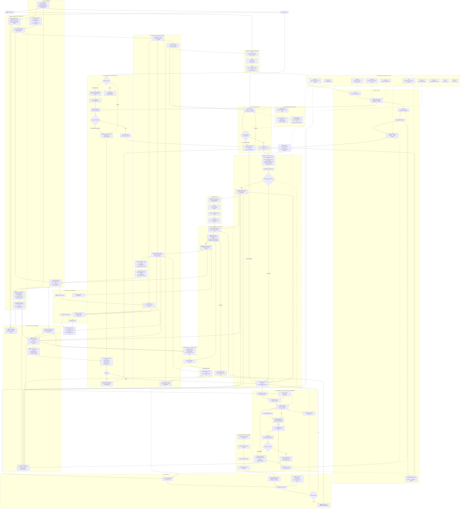

# Jungle Market Architecture v4 — Hardened

```mermaid
flowchart TD

%% =========================================================
%% 1. USER EXPERIENCE
%% =========================================================
subgraph UX["1. USER EXPERIENCE"]
    ART["👩‍🎨 Artisan App<br/>Voice-first onboarding • Upload photos/audio<br/>Enter or verify dimensions • Manage listings"]
    AMB["🧑‍💼 Ambassador Portal<br/>Review low-confidence/conflicting records<br/>Correct facts • Approve listings"]
    BUY["🛒 Buyer Marketplace<br/>Search • Filter • Discover stories<br/>Purchase • Track orders • Leave reviews"]
end

%% =========================================================
%% 2. CONSENT + ACCESS + DATA RIGHTS
%% =========================================================
subgraph ACCESS["2. CONSENT, IDENTITY & DATA RIGHTS"]
    CONSENT["🛡️ Consent & PII Gate<br/>Media consent • Voice consent • Retention choice<br/>PII minimization before storage"]
    AUTH["🔐 Authentication & RBAC<br/>Artisan • Ambassador • Buyer • Admin"]
    REVOKE["🗑️ Consent Revocation / Deletion Request<br/>Withdraw media/voice consent<br/>Request deletion where legally permitted"]
    DELETE["Data Deletion Workflow<br/>Locate media + linked records<br/>Delete/anonymize • write audit event"]
end

ART --> CONSENT
AMB --> AUTH
BUY --> AUTH
CONSENT --> AUTH
ART --> REVOKE
BUY --> REVOKE
REVOKE --> DELETE

%% =========================================================
%% 3. APPLICATION BACKEND
%% =========================================================
subgraph BACKEND["3. BACKEND & APPLICATION SERVICES"]
    API["⚙️ FastAPI API Layer<br/>Primary application/API entry point"]
    JOBS["🔄 Celery + Redis<br/>Async orchestration for CPU-heavy AI jobs"]
    CATALOG["📦 Product Catalog Service<br/>Verified product state • stock • availability"]
    SEARCH["🔎 Search / Index Layer<br/>MVP: PostgreSQL FTS / trigram<br/>Scale: OpenSearch / vector search if needed"]
    REINDEX["♻️ Search Re-index Trigger<br/>Catalog publish/update/stock change<br/>pushes freshness update"]
    ORDER["📑 Order Service<br/>Cart • Orders • Returns • Status"]
    NOTIFY["🔔 Notification Service<br/>Review • Approval • Order • Payout alerts"]
end

AUTH --> API
API --> JOBS
API --> CATALOG
API --> ORDER
API --> NOTIFY

CATALOG --> REINDEX --> SEARCH
SEARCH --> BUY

%% =========================================================
%% 4. MEDIA + PROCESSING ORCHESTRATION
%% =========================================================
IMG["📷 Product Image"]
AUDIO["🎙️ Artisan Voice"]

ART --> IMG
ART --> AUDIO

subgraph PRE["4. IMAGE INGEST & PREPROCESSING"]
    PIL["Pillow<br/>Safe open • verify • EXIF correction • RGB"]
    NP["NumPy<br/>Canonical array representation"]
    CVP["OpenCV<br/>Resize • blur/contrast/light checks<br/>Conditional correction"]
end

subgraph VOICE["5. VOICE INTELLIGENCE"]
    FW["faster-whisper<br/>Speech → transcript<br/>CPU INT8 • optional VAD"]
    TRCONF{"Transcript confidence<br/>acceptable?"}
    TR["Transcript<br/>Story • process • location • effort"]
    RETRY["🎙️ Voice Fallback<br/>Ask artisan to repeat/re-record<br/>or route to Ambassador"]
end

JOBS --> PIL
JOBS --> FW
IMG --> PIL --> NP --> CVP
AUDIO --> FW --> TRCONF
TRCONF -->|"Yes"| TR
TRCONF -->|"Low / noisy / uncertain"| RETRY
RETRY -->|"Re-record"| FW
RETRY -->|"Human assistance"| REVIEW

%% =========================================================
%% 5. FOREGROUND + LOCALIZATION
%% =========================================================
subgraph VISION["6. PRODUCT VISION"]
    REMBG["rembg<br/>Foreground / alpha mask"]
    CLEAN["OpenCV Mask Cleanup<br/>Morphology • connected components • contours"]
    DET["RT-DETRv2-S<br/>Main product localization"]
    CROP["Validated Product Crop"]
    CAT["MobileNetV3-Large<br/>Category → Top-K + confidence"]
    MAT["MobileNetV3 / EfficientNet-B0<br/>Materials → multi-label + confidence"]
end

CVP --> REMBG --> CLEAN --> DET --> CROP
CROP --> CAT
CROP --> MAT

%% =========================================================
%% 6. DIMENSIONS + PLAUSIBILITY SOURCE
%% =========================================================
subgraph DIM["7. DIMENSION CAPTURE & VERIFICATION"]
    CHOICE{"Dimension method"}
    ARUCO["ArUco / ChArUco Capture<br/>Known-size marker beside product"]
    CAL["OpenCV Calibration + Rectification"]
    GEO["OpenCV Geometry<br/>Planar measurement"]
    DVALID{"Scale & geometry valid?"}
    VD["✅ Verified Dimensions<br/>Measured + confidence"]

    MANUAL["✍️ Manual Dimension Entry<br/>Artisan enters width/height/depth"]
    RANGE["📏 Category Plausibility Check<br/>Compare manual dimensions with<br/>historical category distribution"]
    RANGEOK{"Plausible?"}
    SELF["ℹ️ Self-reported Dimensions<br/>Stored with provenance + unverified flag"]

    ARFUT["📱 Future option<br/>Phone AR/depth on supported devices"]
end

CVP --> CHOICE
CHOICE -->|"Reference marker"| ARUCO --> CAL --> GEO --> DVALID
CLEAN --> GEO
DVALID -->|"Valid"| VD
DVALID -->|"Invalid / marker unavailable"| MANUAL
CHOICE -->|"Manual"| MANUAL --> RANGE
RANGE --> RANGEOK
RANGEOK -->|"Yes"| SELF
RANGEOK -->|"Outlier"| REVIEW
CHOICE -.->|"Future"| ARFUT

%% =========================================================
%% 7. FACT FUSION
%% =========================================================
FACTS["👁️ Visual Facts<br/>Category • material • appearance<br/>Verified or self-reported dimensions"]

CAT --> FACTS
MAT --> FACTS
VD --> FACTS
SELF --> FACTS

subgraph FUSION["8. STRUCTURED FACT FUSION"]
    RULES["Deterministic Authority Rules<br/>Voice: story/process/location/effort<br/>Vision: visible category/material/appearance<br/>Dimension provenance always preserved"]
    PYD["Pydantic Product Schema"]
    CONF{"Confidence + consistency OK?"}
    PJ["✅ Validated Product JSON<br/>Includes confidence + provenance"]
    REVIEW["👤 Ambassador Review<br/>Correct uncertain/conflicting/outlier fields"]
end

FACTS --> RULES
TR --> RULES
RULES --> PYD --> CONF
CONF -->|"Yes"| PJ
CONF -->|"Low / conflict"| REVIEW --> PJ

%% =========================================================
%% 8. SEO
%% =========================================================
subgraph SEO["9. GROUNDED SEO"]
    QWEN["Qwen3 4B Instruct GGUF<br/>Drafts only from verified Product JSON"]
    LLAMA["llama.cpp<br/>JSON-constrained generation"]
    SEOV["Pydantic + forbidden-claim checks"]
    COPY["📝 SEO Draft<br/>Title • description • tags • keywords"]
end

PJ --> QWEN --> LLAMA --> SEOV --> COPY

%% =========================================================
%% 9. PRICING
%% =========================================================
subgraph PRICE["10. FAIR PRICING"]
    CB["CatBoost MultiQuantile<br/>p20 • p50 • p80"]
    MARKET["Current-Market Snapshot<br/>Comparable products • freshness • similarity"]
    FLOOR["Artisan Cost Floor<br/>Material + labour + packaging<br/>platform cost + minimum margin"]
    PE["Pricing Decision Engine"]
    PC{"Reliable evidence?"}
    FP["💰 Final Price Range<br/>Recommended typical price"]
end

PJ --> CB
CB --> PE
MARKET --> PE
FLOOR --> PE
PE --> PC
PC -->|"Yes"| FP
PC -->|"No"| REVIEW

%% =========================================================
%% 10. OFFLINE MARKET INTELLIGENCE
%% =========================================================
subgraph MKT["11. OFFLINE MARKET INTELLIGENCE"]
    COL["Collect permitted market observations"]
    NORM["Normalize + comparable matching"]
    OUT["Remove obvious outliers"]
    SNAP["Timestamped market snapshot"]
end

COL --> NORM --> OUT --> SNAP --> MARKET

%% =========================================================
%% 11. MANDATORY PUBLISH GATE
%% =========================================================
subgraph PUBLISH["12. LISTING ASSEMBLY & TRUST GATE"]
    DRAFT["🧩 Assemble Listing Draft<br/>Product JSON + SEO copy + price"]
    TSGATE["🛡️ Listing Risk Gate<br/>Duplicate/fake-listing signals<br/>Suspicious media/metadata<br/>Buyer/review abuse signals"]
    TSR["Manual Risk Review<br/>Escalation for suspicious listings"]
    PUB["🛍️ Published Verified Listing<br/>Only after trust gate approval"]
    UNPUB["⛔ Unpublish / Suspend Listing<br/>Triggered by post-publish risk"]
end

PJ --> DRAFT
COPY --> DRAFT
FP --> DRAFT
DRAFT --> TSGATE
TSGATE -->|"Clear"| PUB
TSGATE -->|"Suspicious"| TSR --> REVIEW

%% =========================================================
%% 12. DATA + MEDIA + HISTORICAL RANGE SOURCE
%% =========================================================
subgraph DATA["13. DATA, CATALOG & PROVENANCE"]
    DB["🗄️ PostgreSQL<br/>Users • products • orders • pricing<br/>verification • reviews • outcomes"]
    MEDIA["☁️ Object Storage<br/>Photos • audio • masks<br/>Retention governed by consent"]
    AUDIT["📜 Provenance / Audit Log<br/>AI outputs • confidence • model version<br/>human corrections"]
    REVIEWDATA["⭐ Review / Buyer Signals<br/>Ratings • complaint flags • abuse signals"]
    RANGESTATS["📊 Dimension Reference Statistics<br/>Historical verified + accepted dimensions<br/>by product category"]
end

PJ --> DB
PUB --> CATALOG
CATALOG --> DB

IMG --> CONSENT --> MEDIA
AUDIO --> CONSENT --> MEDIA
DELETE --> MEDIA
DELETE --> DB
DELETE --> AUDIT

PJ --> AUDIT
REVIEW --> AUDIT

BUY --> REVIEWDATA
REVIEWDATA --> DB
DB --> RANGESTATS
RANGESTATS --> RANGE

%% =========================================================
%% 13. POST-PUBLISH TRUST RE-EVALUATION
%% =========================================================
subgraph POSTTRUST["14. CONTINUOUS POST-PUBLISH TRUST"]
    EVENT["🚨 Risk Event Trigger<br/>Complaint threshold • abuse pattern<br/>fraud signal • moderation report"]
    RECHECK["Re-run Listing Risk Assessment"]
end

REVIEWDATA --> EVENT
DB --> EVENT
EVENT --> RECHECK
RECHECK --> TSGATE
RECHECK -->|"High risk after publish"| UNPUB
UNPUB --> CATALOG
UNPUB --> NOTIFY
UNPUB --> AUDIT

%% =========================================================
%% 14. COMMERCE + INVENTORY
%% =========================================================
subgraph COMMERCE["15. COMMERCE & DISTRIBUTION"]
    PAY["💳 Payment / Checkout"]
    SHIP["🚚 Fulfilment + Tracking"]
    PAYOUT["💵 Artisan Payout"]
    ONDC["🌐 ONDC / External Distribution"]
    INV["📦 Inventory Update<br/>Decrement stock • availability sync"]
end

PUB --> BUY
PUB --> ONDC
BUY --> PAY --> ORDER --> SHIP --> PAYOUT
ORDER --> INV
INV --> CATALOG

%% =========================================================
%% 15. COMMERCE OUTCOMES -> DATABASE
%% =========================================================
OUTCOME["📈 Commerce Outcome Record<br/>Sold price • sale timestamp<br/>time-to-sale • returns/refunds • fulfilment result"]

ORDER --> OUTCOME
SHIP --> OUTCOME
PAYOUT --> OUTCOME
OUTCOME --> DB

%% =========================================================
%% 16. FEEDBACK, EVALUATION & STAGED MODEL ROLLOUT
%% =========================================================
subgraph LEARN["16. FEEDBACK, EVALUATION & MODEL IMPROVEMENT"]
    CORR["Ambassador Corrections<br/>Ground-truth labels"]
    SALES["Actual Commerce Outcomes<br/>Read from DB"]
    DATASET["Versioned Training / Evaluation Dataset"]
    EVAL["Offline Evaluation<br/>Accuracy • calibration • bias • review rate"]
    THRESH["Confidence Threshold Recalibration"]

    CAND["Candidate Model Version"]
    SHADOW["Shadow Evaluation<br/>Runs beside production<br/>No user-facing decisions"]
    CANARY["Canary Router<br/>Small controlled live traffic share"]
    CANDLIVE["Candidate Model<br/>Receives canary traffic only"]
    PROD["Current Production Model<br/>Default live traffic"]
    PROMOTE{"Promotion criteria met?"}
    ROLLBACK["↩️ Rollback Controller<br/>Immediately routes canary traffic<br/>back to previous production version"]
    REG["Production Model Registry<br/>Approved version + previous stable version"]
end

REVIEW --> CORR
DB --> SALES
CORR --> DATASET
SALES --> DATASET
DATASET --> EVAL
EVAL --> THRESH
EVAL --> CAND

CAND --> SHADOW
SHADOW -->|"Pass"| CANARY
SHADOW -->|"Fail"| EVAL

CANARY --> CANDLIVE
CANARY --> PROD
CANDLIVE --> PROMOTE

PROMOTE -->|"Yes"| REG
PROMOTE -->|"No / regression"| ROLLBACK
ROLLBACK --> PROD
ROLLBACK --> AUDIT
ROLLBACK --> EVAL

REG --> PROD

THRESH -.-> CONF
THRESH -.-> PC

PROD -.-> CAT
PROD -.-> MAT
PROD -.-> DET
PROD -.-> CB

%% =========================================================
%% 17. SCALING + LANGUAGE QUALITY
%% =========================================================
subgraph SCALE["17. SCALING & LANGUAGE QUALITY"]
    BATCH["Batch inference<br/>Larger job batches / queue tuning"]
    GPU["Optional GPU Workers<br/>When CPU latency/throughput becomes limiting"]
    LANG["Regional Language Evaluation<br/>Dialect/noise benchmark set<br/>Whisper quality monitoring"]
end

JOBS -.-> BATCH
BATCH -.-> GPU
FW -.-> LANG
LANG -.-> EVAL
LANG -.-> TRCONF

%% =========================================================
%% 18. OPTIONAL / LATER
%% =========================================================
subgraph LATER["18. BENCHMARKS / OPTIONAL / LATER"]
    CLIP["CLIP<br/>Label bootstrap / zero-shot suggestions"]
    SAM["SAM / SAM2<br/>Annotation + manual mask correction"]
    BIREF["BiRefNet<br/>Optional high-quality foreground tier"]
    QV["Qwen2.5-VL<br/>Optional ambiguous-case assistant"]
    SK["scikit-image<br/>Offline CV experiments"]
    LGBM["LightGBM<br/>Pricing benchmark"]
    XGB["XGBoost<br/>Pricing benchmark"]
    NO1["MODNet<br/>No product-pipeline use"]
    NO2["LLaVA<br/>No MVP use"]
    NO3["InternVL<br/>No MVP use"]
end

CLIP -.-> CAT
CLIP -.-> MAT
SAM -.-> CLEAN
BIREF -.-> REMBG
QV -.-> REVIEW
SK -.-> CLEAN
LGBM -.-> CB
XGB -.-> CB

```
